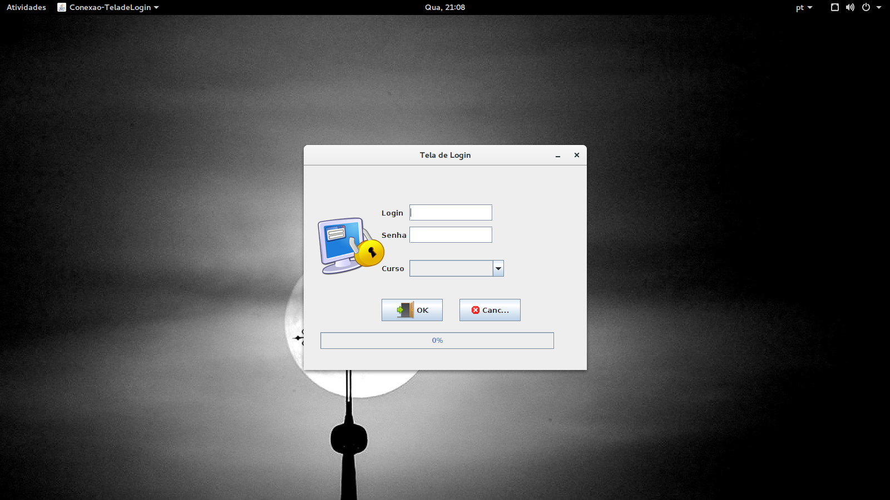

# SIGLAB
### Um Sistema para gerenciamento de Laboratórios no Campus Senador Helvídio Nunes de Barros 

O Sistema desenvolvido possui as funcionalidades de:

* CRUD (Criação, Leitura, Atualização e Remoção) de usuários
* Controle de Máquinas
* Geração de Relatórios

#### Instruções de Uso:
+ Para execução da aplicação, executar o arquivo "TeladeLogin.java", no pacote "Conexao".
+ Inserir os dados Usuário: "admsi" / Senha: "geek" / Curso: "Sistemas de Informação"

Screenshots

1. Tela de Login

2. Tela Principal

3. Cadastro de Usuários

4. Alteração de Usuários

5. Busca por Usuários 

6. Listagem de Alunos

